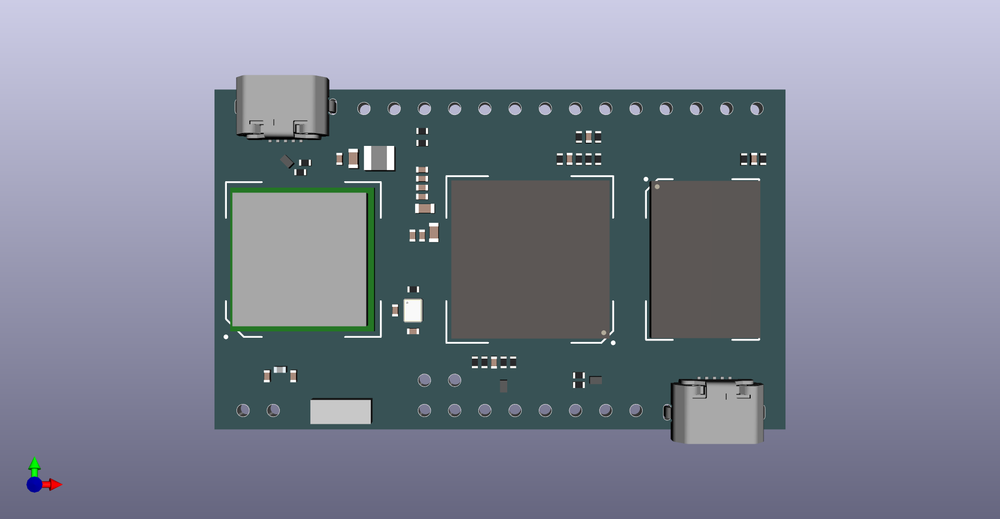

# PCB加工和贴片生产说明

## 设计

* 六层通孔板(假八层)
* 板框尺寸：48mm x 28.6mm
* 最小线宽：0.1mm/4mil
* 最小线距：0.1mm/4mil
* 最小通孔（镀铜）：外径0.4mm，内径0.2mm/8mil，孔环0.1mm/4mil
* 最小焊盘或过孔（环）与走线间距：0.1mm/4mil
* 最小阻焊宽度：0.15mm/6mil
* 阻焊颜色：绿色亚光
* 丝印颜色：白色
* 焊盘喷镀：沉金
* 拼板：5拼

拼板需加工方给出拼板建议;

如下图所示，注意板边缘的micro USB连接器凸出板边0.8mm。拼板时长边间距应不少于1mm，避免贴片时发生物料干涉。

## 叠层

注意：表层和内层均1oz铺铜。其中1/3/4/6层有阻抗线。

层|材料|厚度|说明
-|-|-|-
1|铜|1.2mil，1oz|top
-|FR4|3.6mil
2|铜|1.2mil，1oz|ln1，地平面
-|FR4|4.6mil
3|铜|1.2mil，1oz|ln2，信号
-|FR4|36mil
4|铜|1.2mil，1oz|ln3，信号
-|FR4|4.6mil
5|铜|1.2mil，1oz|ln4，电源平面
-|FR4|3.6mil
6|铜|1.2mil，1oz|bottom

总厚度：59.6mil ～= 1.5mm

## 加工文件清单

文件名|格式|说明
-|-|-
require.drl|Excellon|钻孔文件
require-Edge.Cuts.gbr|gerber|板框
require-F.Cu.gbr|gerber|正面
require-ln1.Cu.gbr|gerber|内层1
require-ln2.Cu.gbr|gerber|内层2
require-ln3-Cu.gbr|gerber|内层3
require-ln4-Cu.gbr|gerber|内层4
require-B.Cu.gbr|gerber|背面
require-F.Mask.gbr|gerber|正面阻焊
require-B.Mask.gbr|gerber|背面阻焊
require-F.Paste.gbr|gerber|正面钢网/锡膏
require-B.Paste.gbr|gerber|背面钢网/锡膏
require-F.Fab.gbr|gerber|正面摆件位置
require-B.Fab.gbr|gerber|背面摆件位置
require.bom|文本文件|BOM（尚未提供）

## 贴片说明

1. Fab文件内，除microUSB连接器之外其他器件均以器件中心点为摆件位置；
2. 除IC，天线和静电管（ESD）器件之外，所有器件为无极性器件，无摆件方向；
3. IC均以丝印标注1脚位置，圆点或三角；
4. 天线和静电管，无丝印，引脚焊盘不对称，可通过FAB文件或焊盘确定摆件方向；

